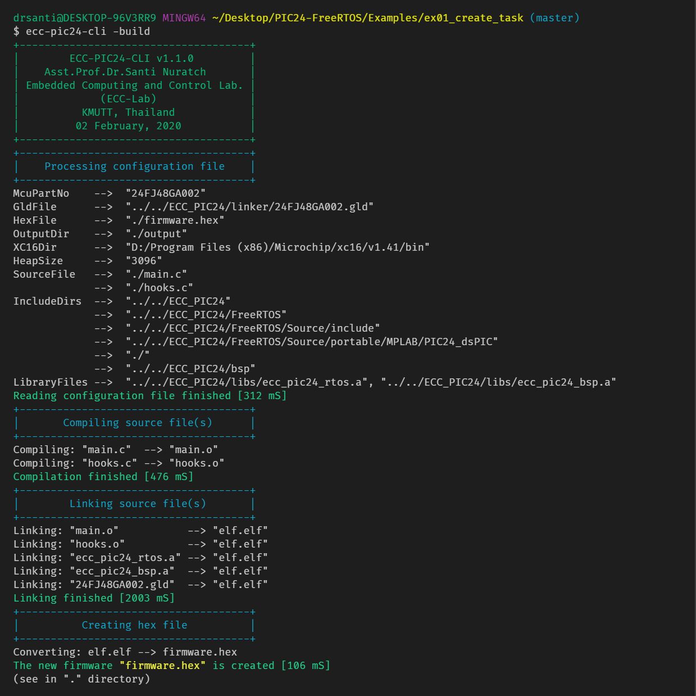
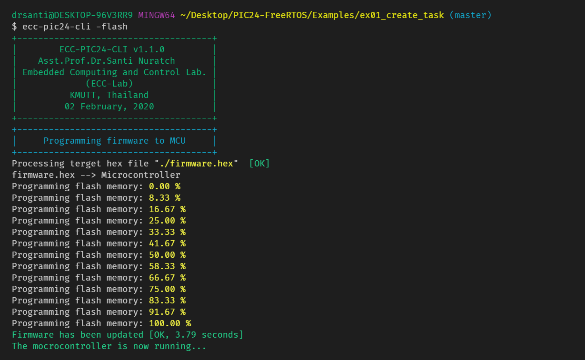
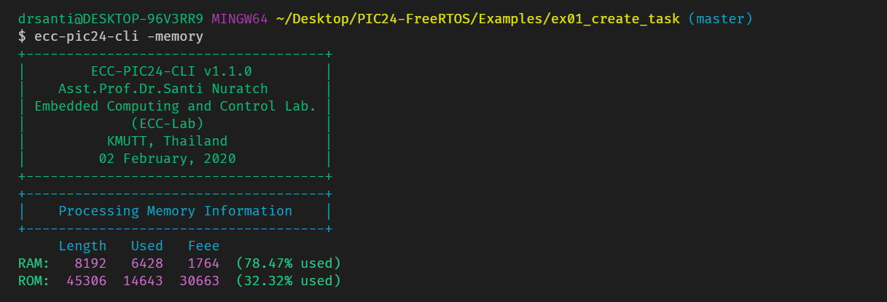

# PIC24 + FreeRTOS

## Instructions

0. Add the full path of `ecc-pic24-cli`, e.g., `C:/ROOT/ECC_PIC24/cli/ecc-pic24-cli` to `PATH` of the `Environment Variables`.

1. Connect the GRIFFIN (PIC24) board to the computer.

2. Edit the `XC16_DIR` and others in the configuration file, `config.cfg`, (check in the target example directory).

3. Open a Terminal and change directory a target example directory, e.g., `cd Examples/ex01_create_task`.

4. Compile (generate a target hex file)

```text
ecc-pic24-cli -build
```

5. Upload the hex file to the microcontroller

```text
ecc-pic24-cli -build
```

---

### ecc-pic24-cli -build




### ecc-pic24-cli -flash




### ecc-pic24-cli -memory


